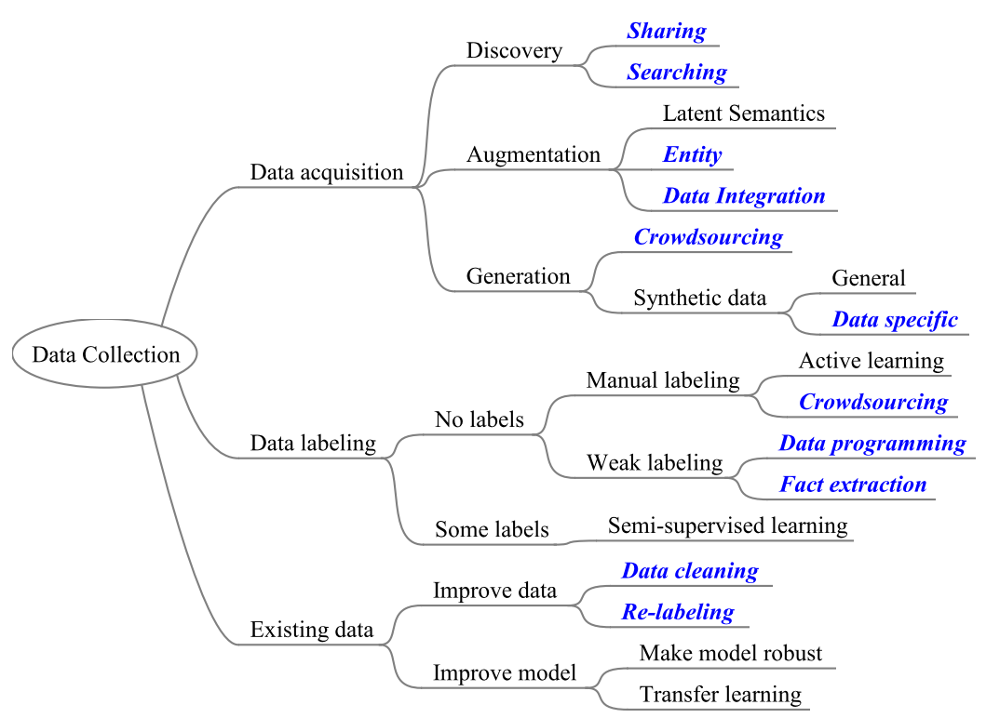

# MiraData

------------

A suite of tools for generating high quality training and validation data for AI applications.

## Overview



## Usage

### Requirements

* python 3.6

### Dependencies

```
pip install -r requirements.txt
```

------------

## DATA AUGMENTATION

### Identify Similar Columns

- For each column C, a set of columns identified which tend to confuse with the column C.

### Identify Representative Aliases 

- For each column C, find several 3-5 most represenative aliases. 

### Paraphrase (Backtranslation)

-

### Weak Supervision

-

### Contextual data augmentation

-

### RISD

- **Synonym Replacement (SR):** Randomly choose *n* words from the sentence that are not stop words. Replace each of these words with one of its synonyms chosen at random.
- **Random Insertion (RI):** Find a random synonym of a random word in the sentence that is not a stop word. Insert that synonym into a random position in the sentence. Do this *n* times.
- **Random Swap (RS):** Randomly choose two words in the sentence and swap their positions. Do this *n* times.
- **Random Deletion (RD):** For each word in the sentence, randomly remove it with probability *p*.

------------

## Project Organization

    ├── LICENSE
    ├── Makefile           <- Makefile with commands like `make data` or `make train`
    ├── README.md          <- The top-level README for developers using this project.
    ├── data
    │   ├── external       <- Data from third party sources.
    │   ├── interim        <- Intermediate data that has been transformed.
    │   ├── processed      <- The final, canonical data sets for modeling.
    │   └── raw            <- The original, immutable data dump.
    │
    ├── docs               
    │
    ├── models             <- Trained and serialized models, model predictions, or model summaries
    │
    ├── notebooks          <- Jupyter notebooks. Naming convention is a number (for ordering),
    │                         the creator's initials, and a short `-` delimited description, e.g.
    │                         `1.0-jqp-initial-data-exploration`.
    │
    ├── references         <- Data dictionaries, manuals, and all other explanatory materials.
    │
    ├── reports            <- Generated analysis as HTML, PDF, LaTeX, etc.
    │   └── figures        <- Generated graphics and figures to be used in reporting
    │
    ├── requirements.txt   <- The requirements file for reproducing the analysis environment, e.g.
    │                         generated with `pip freeze > requirements.txt`
    │
    ├── setup.py           <- makes project pip installable (pip install -e .) so src can be imported
    ├── src                <- Source code for use in this project.
    │   ├── __init__.py    <- Makes src a Python module
    │   │
    │   ├── data           <- Scripts to download or generate data
    │   │   └── make_dataset.py
    │   │
    │   ├── features       <- Scripts to turn raw data into features for modeling
    │   │   └── build_features.py
    │   │
    │   ├── models         <- Scripts to train models and then use trained models to make
    │   │   │                 predictions
    │   │   ├── predict_model.py
    │   │   └── train_model.py
    │   │
    │   └── visualization  <- Scripts to create exploratory and results oriented visualizations
    │       └── visualize.py
    │
    └── tox.ini            <- tox file with settings for running tox; see tox.testrun.org

